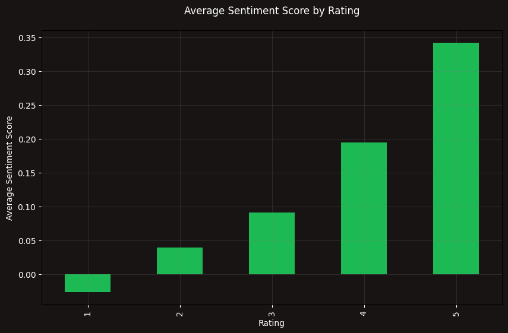
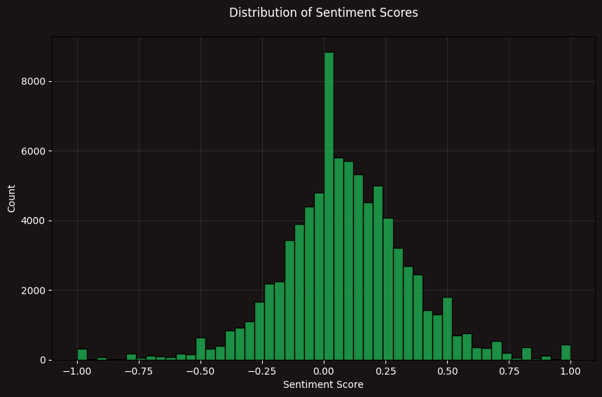
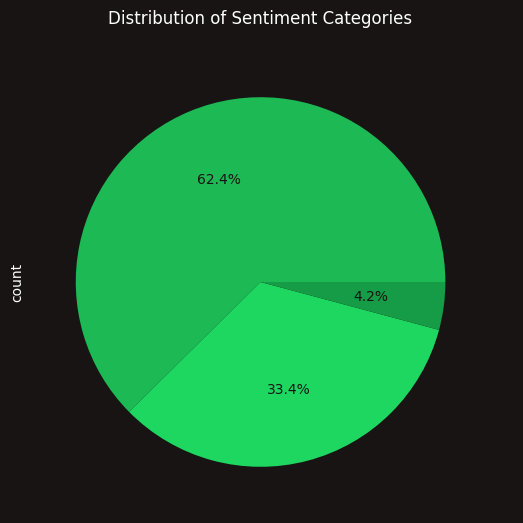

# Sentiment Analysis with Spotify Data

This repository contains code and resources for performing sentiment analysis on Spotify data. 

## Overview

Sentiment analysis is the process of determining the emotional tone behind a series of text data. In this project, we aim to analyze the sentiment of song lyrics from Spotify's vast music library. By understanding the sentiment of songs, we can gain insights into the emotional impact of music on listeners.
 

## Results
First lets look at the average sentiment score from this dataset

This bar chart compares average sentiment scores (on the y-axis) against star ratings (on the x-axis, from 1 to 5). You can see that:

1-star ratings have a slightly negative average sentiment (around 
−
0.03
−0.03).
2-star ratings move into the positive range (about 
0.04
0.04).
3-star ratings have a moderate positive sentiment (~
0.09
0.09).
4-star ratings show even more positivity (~
0.19
0.19).
5-star ratings are the most positive (~
0.34
0.34).
Overall, the figure indicates that as the star rating increases, so does the average sentiment score. In other words, users who leave higher ratings also tend to use more positive language, while the 1-star reviews are slightly negative on average.

This histogram shows how the sentiment scores (ranging roughly from -1 to +1) are distributed across all reviews. A few key observations:

Peak Around Zero
The highest bar (tallest peak) is near 0.0 on the sentiment scale, indicating that a large portion of reviews are “neutral” or have very mild positive/negative language.
Spread into Negative and Positive
While most scores cluster around neutral (0.0), there is a noticeable spread in both the negative (left) and positive (right) directions. The negative tail extends down to around -1, and the positive tail up to around +1, though these extremes contain fewer reviews.
Slight Skew
There appear to be more reviews with slightly positive scores than strongly negative ones. Nonetheless, the bulk of the distribution is centered near zero, suggesting that, overall, reviewers tend to use language that isn’t strongly polarized one way or the other.
Overall, the chart tells you that most of the text sentiment in these reviews is near neutral, with a moderate portion that leans positive and a smaller portion that leans more strongly negative.

This pie chart shows the proportion of reviews falling into each sentiment category. From the percentages given:

Positive: ~62.4%
Neutral: ~33.4%
Negative: ~4.2%
The takeaway is that most of the reviews (nearly two-thirds) have a positive sentiment, while about one-third are neutral, and only a small fraction is negative. Overall, the sentiment skew is strongly positive.

## Conclusion

In this project, we have successfully performed sentiment analysis on Spotify song lyrics. By understanding the emotional impact of music, we can gain valuable insights into the listener's experience. If you have any questions or feedback, please let us know.
