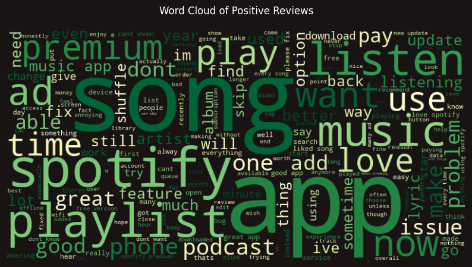
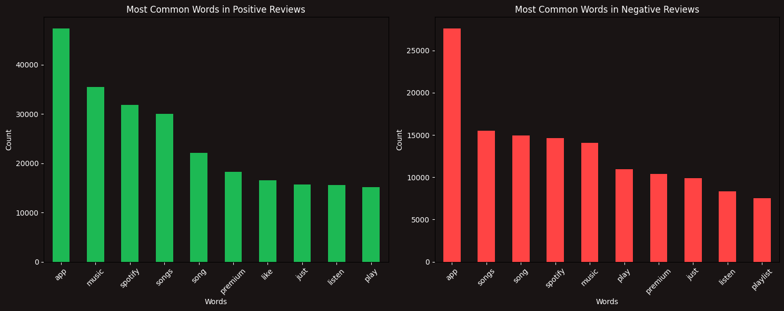

<<<<<<< HEAD
# Sentiment Analysis with Spotify Data

This repository contains code and resources for performing sentiment analysis on Spotify data. 

## Overview

Sentiment analysis is the process of determining the emotional tone behind a series of text data. In this project, we aim to analyze the sentiment of song lyrics from Spotify's vast music library. By understanding the sentiment of songs, we can gain insights into the emotional impact of music on listeners.
 

## Results
First lets look at the average sentiment score from this dataset

This bar chart compares average sentiment scores (on the y-axis) against star ratings (on the x-axis, from 1 to 5). You can see that:

1-star ratings have a slightly negative average sentiment (around 
−
0.03
−0.03).
2-star ratings move into the positive range (about 
0.04
0.04).
3-star ratings have a moderate positive sentiment (~
0.09
0.09).
4-star ratings show even more positivity (~
0.19
0.19).
5-star ratings are the most positive (~
0.34
0.34).
Overall, the figure indicates that as the star rating increases, so does the average sentiment score. In other words, users who leave higher ratings also tend to use more positive language, while the 1-star reviews are slightly negative on average.

This histogram shows how the sentiment scores (ranging roughly from -1 to +1) are distributed across all reviews. A few key observations:

Peak Around Zero
The highest bar (tallest peak) is near 0.0 on the sentiment scale, indicating that a large portion of reviews are “neutral” or have very mild positive/negative language.
Spread into Negative and Positive
While most scores cluster around neutral (0.0), there is a noticeable spread in both the negative (left) and positive (right) directions. The negative tail extends down to around -1, and the positive tail up to around +1, though these extremes contain fewer reviews.
Slight Skew
There appear to be more reviews with slightly positive scores than strongly negative ones. Nonetheless, the bulk of the distribution is centered near zero, suggesting that, overall, reviewers tend to use language that isn’t strongly polarized one way or the other.
Overall, the chart tells you that most of the text sentiment in these reviews is near neutral, with a moderate portion that leans positive and a smaller portion that leans more strongly negative.

This pie chart shows the proportion of reviews falling into each sentiment category. From the percentages given:

Positive: ~62.4%
Neutral: ~33.4%
Negative: ~4.2%
The takeaway is that most of the reviews (nearly two-thirds) have a positive sentiment, while about one-third are neutral, and only a small fraction is negative. Overall, the sentiment skew is strongly positive.

This word cloud gives a quick visual snapshot of the most frequently mentioned words in positive reviews. The larger or bolder the word, the more often it appears. Here are a few key takeaways:

Listening & Music
Words like “song,” “listen,” “playlist,” “app,” and “music” dominate, reflecting that people often praise the ability to discover and play songs or playlists.
Spotify & Premium
References to “spotify” and “premium” highlight how many users talk about the service’s paid features—often noting they enjoy ad-free listening, better audio quality, or other premium perks.
Podcasts
The word “podcast” appears prominently, indicating that podcasts are a positive factor for many reviewers as part of their overall listening experience.
Ads & Issues
Interestingly, “ad” and “issue” show up even in the positive word cloud—usually in the context of wanting fewer ads or praising the app despite minor issues they’ve run into.
General Sentiment
Words like “love,” “good,” and “better” reinforce that, on the whole, positive reviews highlight enjoyment, satisfaction, and improvement suggestions, rather than major complaints.
Overall, the word cloud indicates that access to music, ease of use, and premium features are the chief reasons these reviewers are enthusiastic about the service.

These two bar charts compare the most frequently used words in positive reviews (left) versus negative reviews (right). Although many of the same core terms appear in both (e.g., “app,” “songs,” “music,” “spotify,” “premium”), there are a few noteworthy differences:

Overall Usage Volume
The word “app” is the single most common term in both positive and negative reviews, which makes sense given they’re all about a mobile/desktop application.
In positive reviews, “app” usage is extremely high, reflecting general praise (“Great app,” “Love the app,” etc.).
In negative reviews, “app” is still the top word but often in a complaining context (“App crashes,” “App won’t load,” etc.).
Positive Review Terms
Words like “like,” “music,” “songs,” and “song” appear very frequently—often praising the ability to discover, play, or enjoy music.
“Premium” shows up quite a bit on the positive side, suggesting users are happy with subscription features (fewer ads, higher quality, offline playback, etc.).
“Listen” and “play” are also common, emphasizing that the core functionality (listening to music/podcasts) is a key reason for positive sentiment.
Negative Review Terms
While “songs,” “music,” and “spotify” also appear in negative reviews, they likely describe frustrations (e.g., missing songs, playback issues).
“Play,” “premium,” and “playlist” also appear, possibly indicating complaints about subscription costs, playlist limitations, or ad interruptions.
Words like “just” often crop up in negative reviews with phrases such as “It just doesn’t work” or “I just want it to play my music.”
Context Matters
Seeing the same words in both positive and negative lists doesn’t necessarily mean users feel the same way; the context behind how those words are used can differ drastically.
For instance, “premium” in positive reviews may highlight satisfaction, whereas in negative reviews it may highlight cost frustration or unmet expectations.
In short, both sets of reviews talk about the core Spotify features (app, songs, music, playlists, premium), but the sentiment behind those words diverges—praise vs. complaint—depending on the user experience.

## Conclusion

In this project, we have successfully performed sentiment analysis on Spotify song lyrics. By understanding the emotional impact of music, we can gain valuable insights into the listener's experience. If you have any questions or feedback, please let us know.
=======
# Sentiment Analysis with Spotify Data

This repository contains code and resources for performing sentiment analysis on Spotify data. 

## Overview

Sentiment analysis is the process of determining the emotional tone behind a series of text data. In this project, we aim to analyze the sentiment of song lyrics from Spotify's vast music library. By understanding the sentiment of songs, we can gain insights into the emotional impact of music on listeners.
 

## Results
First lets look at the average sentiment score from this dataset

This bar chart compares average sentiment scores (on the y-axis) against star ratings (on the x-axis, from 1 to 5). You can see that:

1-star ratings have a slightly negative average sentiment (around 
−
0.03
−0.03).
2-star ratings move into the positive range (about 
0.04
0.04).
3-star ratings have a moderate positive sentiment (~
0.09
0.09).
4-star ratings show even more positivity (~
0.19
0.19).
5-star ratings are the most positive (~
0.34
0.34).
Overall, the figure indicates that as the star rating increases, so does the average sentiment score. In other words, users who leave higher ratings also tend to use more positive language, while the 1-star reviews are slightly negative on average.

This histogram shows how the sentiment scores (ranging roughly from -1 to +1) are distributed across all reviews. A few key observations:

Peak Around Zero
The highest bar (tallest peak) is near 0.0 on the sentiment scale, indicating that a large portion of reviews are “neutral” or have very mild positive/negative language.
Spread into Negative and Positive
While most scores cluster around neutral (0.0), there is a noticeable spread in both the negative (left) and positive (right) directions. The negative tail extends down to around -1, and the positive tail up to around +1, though these extremes contain fewer reviews.
Slight Skew
There appear to be more reviews with slightly positive scores than strongly negative ones. Nonetheless, the bulk of the distribution is centered near zero, suggesting that, overall, reviewers tend to use language that isn’t strongly polarized one way or the other.
Overall, the chart tells you that most of the text sentiment in these reviews is near neutral, with a moderate portion that leans positive and a smaller portion that leans more strongly negative.

This pie chart shows the proportion of reviews falling into each sentiment category. From the percentages given:

Positive: ~62.4%
Neutral: ~33.4%
Negative: ~4.2%
The takeaway is that most of the reviews (nearly two-thirds) have a positive sentiment, while about one-third are neutral, and only a small fraction is negative. Overall, the sentiment skew is strongly positive.

This word cloud gives a quick visual snapshot of the most frequently mentioned words in positive reviews. The larger or bolder the word, the more often it appears. Here are a few key takeaways:

Listening & Music
Words like “song,” “listen,” “playlist,” “app,” and “music” dominate, reflecting that people often praise the ability to discover and play songs or playlists.
Spotify & Premium
References to “spotify” and “premium” highlight how many users talk about the service’s paid features—often noting they enjoy ad-free listening, better audio quality, or other premium perks.
Podcasts
The word “podcast” appears prominently, indicating that podcasts are a positive factor for many reviewers as part of their overall listening experience.
Ads & Issues
Interestingly, “ad” and “issue” show up even in the positive word cloud—usually in the context of wanting fewer ads or praising the app despite minor issues they’ve run into.
General Sentiment
Words like “love,” “good,” and “better” reinforce that, on the whole, positive reviews highlight enjoyment, satisfaction, and improvement suggestions, rather than major complaints.
Overall, the word cloud indicates that access to music, ease of use, and premium features are the chief reasons these reviewers are enthusiastic about the service.

These two bar charts compare the most frequently used words in positive reviews (left) versus negative reviews (right). Although many of the same core terms appear in both (e.g., “app,” “songs,” “music,” “spotify,” “premium”), there are a few noteworthy differences:

Overall Usage Volume
The word “app” is the single most common term in both positive and negative reviews, which makes sense given they’re all about a mobile/desktop application.
In positive reviews, “app” usage is extremely high, reflecting general praise (“Great app,” “Love the app,” etc.).
In negative reviews, “app” is still the top word but often in a complaining context (“App crashes,” “App won’t load,” etc.).
Positive Review Terms
Words like “like,” “music,” “songs,” and “song” appear very frequently—often praising the ability to discover, play, or enjoy music.
“Premium” shows up quite a bit on the positive side, suggesting users are happy with subscription features (fewer ads, higher quality, offline playback, etc.).
“Listen” and “play” are also common, emphasizing that the core functionality (listening to music/podcasts) is a key reason for positive sentiment.
Negative Review Terms
While “songs,” “music,” and “spotify” also appear in negative reviews, they likely describe frustrations (e.g., missing songs, playback issues).
“Play,” “premium,” and “playlist” also appear, possibly indicating complaints about subscription costs, playlist limitations, or ad interruptions.
Words like “just” often crop up in negative reviews with phrases such as “It just doesn’t work” or “I just want it to play my music.”
Context Matters
Seeing the same words in both positive and negative lists doesn’t necessarily mean users feel the same way; the context behind how those words are used can differ drastically.
For instance, “premium” in positive reviews may highlight satisfaction, whereas in negative reviews it may highlight cost frustration or unmet expectations.
In short, both sets of reviews talk about the core Spotify features (app, songs, music, playlists, premium), but the sentiment behind those words diverges—praise vs. complaint—depending on the user experience.

## Conclusion

In this project, we have successfully performed sentiment analysis on Spotify song lyrics. By understanding the emotional impact of music, we can gain valuable insights into the listener's experience. If you have any questions or feedback, please let us know.
>>>>>>> 34f5a5c (modified:   .gitignore)
